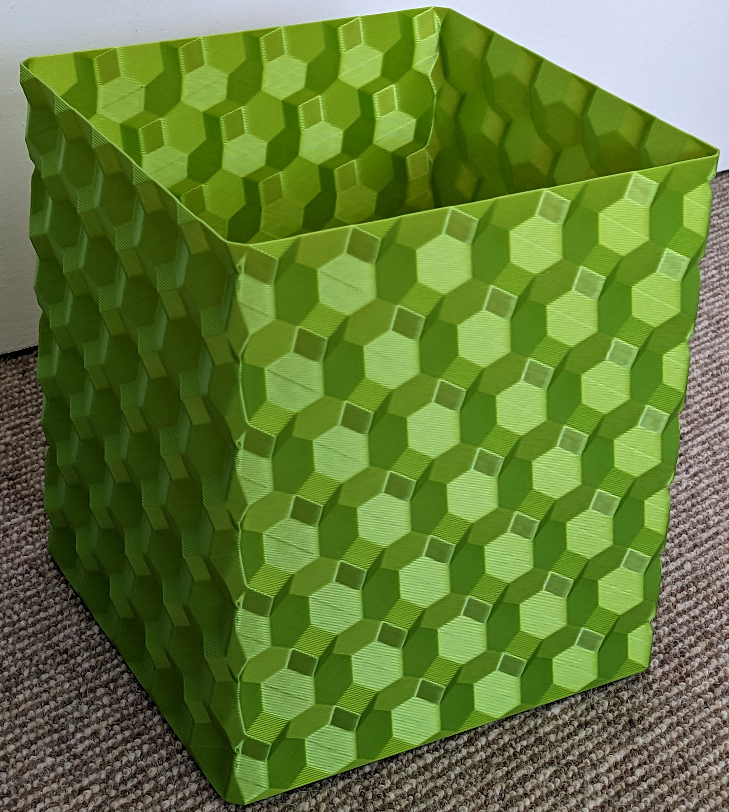
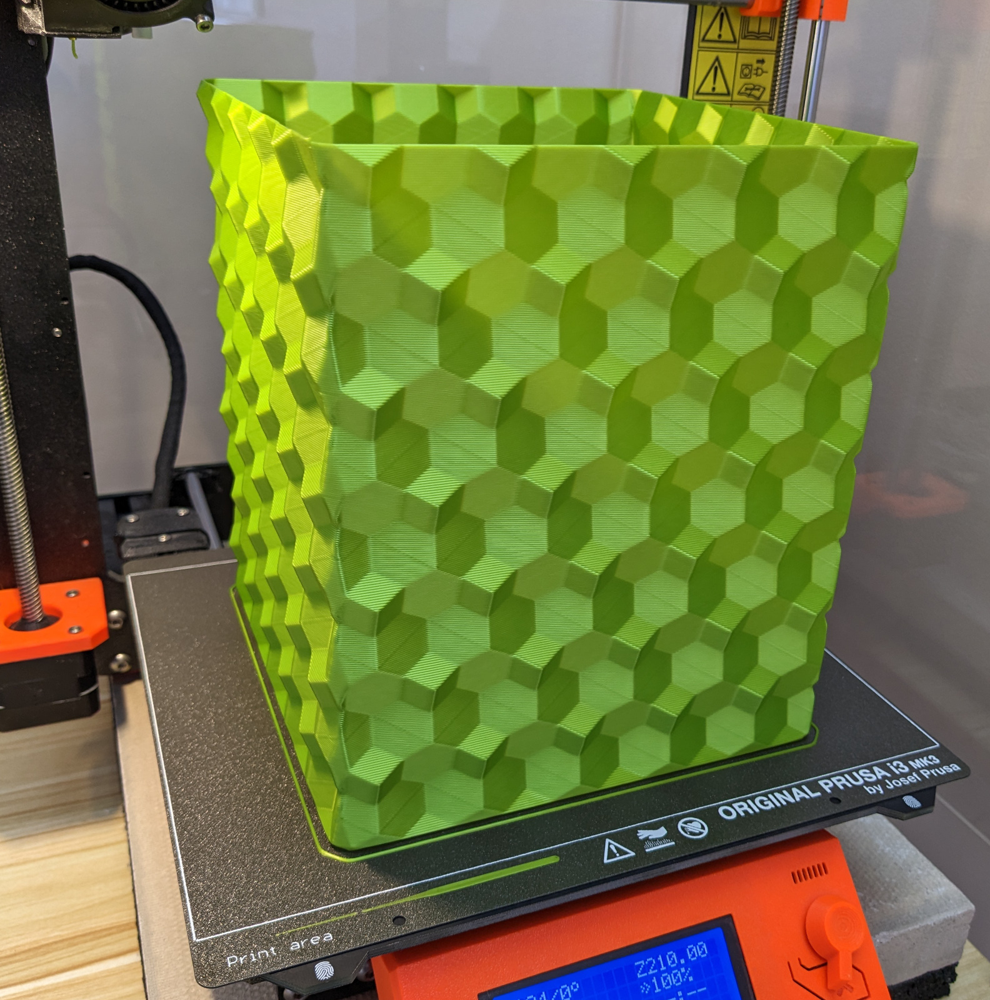
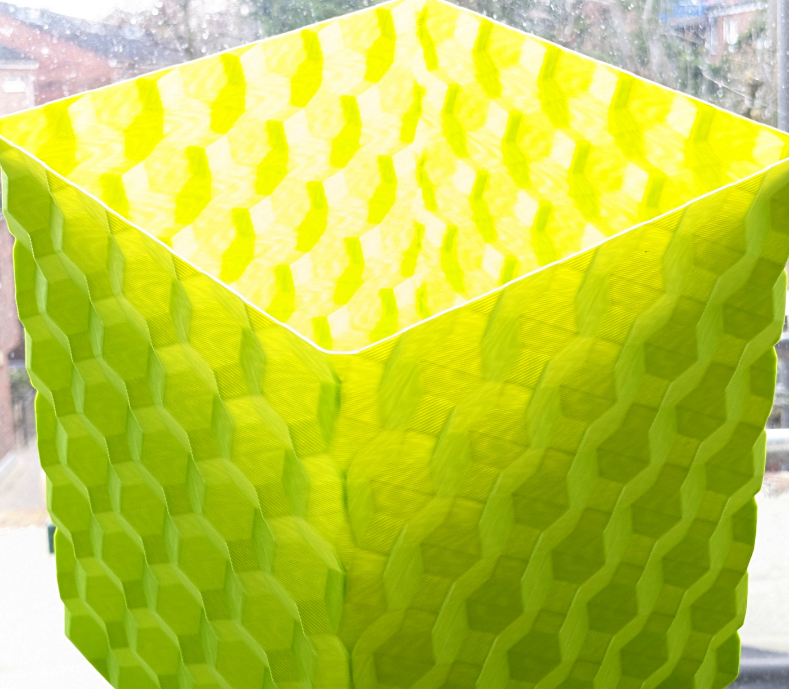

Hypercube pattern vase mode bin 3D model
==

This repository contains the modified version of the Hypercube Pen Holder, repurposed as a vase mode bin.

## Modifications

The original Hypercube Pen Holder model was downloaded from [Printables.com](https://www.printables.com/model/312576-hypercube-pen-holder). 
The following modifications were made to the model:

1. Repaired the mesh to fix any issues that might affect printing.
2. Optimized the model for printing in vase mode.
3. Adjusted the size to make it suitable to collect PLA waste or any other medium-sized objects.
4. Added chamfer in the bottom to improve general appeal.

## Printing Instructions

1. Print the model in vase mode.
2. Use a 0.8mm nozzle or larger for faster print time and to make the result bin more sturdy.
3. Recommended layer height: 0.5mm+, but 0.3mm should also work.
4. No supports are required for this print.

## More Photos
Fresh out of the printer

Translucent in the sun

